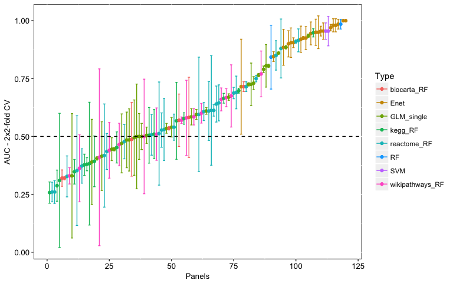

# How to use the functions in this package
Amrit Singh  
December 3, 2016  


```r
library(amritr)
library(mixOmics)
```

#biomarker pipeline()
## y~X, y = binary response, X = nxp dataset
### Description of classification algorithms
  * Enet panels (alpha = 0-0.9, step = 0.1) with and without a p-value filter (topranked = # of top ranked significant features to use)
  * random forest panels with and without a p-value filter (topranked = # of top ranked features to use)
  * support vector machine panels with and without a p-value filter (topranked = # of top ranked features to use)
  * single (p) biomarkers (based on a glm model)
  * pathway biomarkers based on geneset from BioCarta_2016, KEGG_2016, Reactome_2016, and WikiPathways_2016 from Enrichr (each panel is a geneset from a given database)

### Inputs and outputs
  * Input:
          + X = nxp dataset
          + y = n-vector of class labels
          + topranked = 30 (number of significant features to input into classifier)
          + validation = "Mfold" or "loo"
          + M = 2 - # of folds in the cross-validation scheme
          + iter - # of times to repeat cross-validation
          + threads - # of cores, each running a cross-validation scheme
          + pathways - list of lists each for a different database; each element is a genset consisting of gene symbols
  * Output:
          + a dataframe with columns, Mean and SD of CV-AUC, Panel_label, Genes (within panels), Type of Panel (Enet, RF, SVM, GLM, Pathways(biocarta, kegg, reactome, wikipathways))


```r
data("pathways"); data("breast.TCGA")

Y = breast.TCGA$data.train$subtype
names(Y) <- rownames(breast.TCGA$data.train$mrna)

Y = c(Y[Y == "Basal"][1:10], Y[Y == "Her2"][1:10])
Y[Y == 1] <- "Basal"
Y[Y == 2] <- "Her2"
Y <- factor(Y)
set.seed(123)
X = breast.TCGA$data.train$mrna[names(Y), sample(1:200, 30)]

## run biomarker pipeline for a binary response
allPanels <- biomarkerPipeline(X = X, Y = Y, topranked = 30, validation = "Mfold", M = 2, 
             iter = 2, threads = 2, progressBar = TRUE, pathways = pathways)
head(allPanels)
```

```
##    Mean          SD         Panel
## 1 0.885 0.077781746   Enet_0_none
## 2 0.955 0.035355339 Enet_0.1_none
## 3 0.925 0.007071068 Enet_0.2_none
## 4 0.945 0.049497475 Enet_0.3_none
## 5 0.970 0.014142136 Enet_0.4_none
## 6 0.980 0.028284271 Enet_0.5_none
##                                                                                                                                                                                       Genes
## 1 TANC2_NCF4_AHR_ZNRF3_MEGF9_ETS2_TTC39A_MEX3A_APOD_AMPD3_LEF1_C18orf1_E2F1_ALCAM_HTRA1_CDK18_AKAP12_SEMA4A_RHOU_AMN1_SGPP1_ICA1_ZKSCAN1_C1orf162_FMNL2_AKAP9_EIF4EBP3_CERCAM_MAP3K1_TBXAS1
## 2                             TANC2_ZNRF3_MEGF9_ETS2_TTC39A_MEX3A_APOD_AMPD3_C18orf1_E2F1_ALCAM_HTRA1_CDK18_AKAP12_RHOU_AMN1_SGPP1_ICA1_ZKSCAN1_C1orf162_FMNL2_AKAP9_EIF4EBP3_MAP3K1_TBXAS1
## 3                                            TANC2_ZNRF3_MEGF9_ETS2_TTC39A_MEX3A_APOD_AMPD3_E2F1_ALCAM_HTRA1_CDK18_AKAP12_RHOU_AMN1_SGPP1_ICA1_ZKSCAN1_C1orf162_FMNL2_AKAP9_EIF4EBP3_MAP3K1
## 4                                                         TANC2_ZNRF3_MEGF9_ETS2_TTC39A_MEX3A_APOD_AMPD3_E2F1_ALCAM_HTRA1_CDK18_AKAP12_RHOU_AMN1_SGPP1_ICA1_ZKSCAN1_C1orf162_FMNL2_EIF4EBP3
## 5                                                                    TANC2_ZNRF3_ETS2_TTC39A_MEX3A_APOD_AMPD3_ALCAM_HTRA1_CDK18_AKAP12_RHOU_AMN1_SGPP1_ICA1_ZKSCAN1_C1orf162_FMNL2_EIF4EBP3
## 6                                                                                TANC2_ZNRF3_ETS2_TTC39A_MEX3A_APOD_AMPD3_ALCAM_HTRA1_CDK18_RHOU_SGPP1_ICA1_ZKSCAN1_C1orf162_FMNL2_EIF4EBP3
##   Type
## 1 Enet
## 2 Enet
## 3 Enet
## 4 Enet
## 5 Enet
## 6 Enet
```

### Plot AUC (Mean +/- SD) of all panels


```r
allPanels %>% arrange(Mean) %>% mutate(Panel = 1:nrow(.)) %>% 
  ggplot(aes(x = Panel, y = Mean, color = Type)) + geom_point() +
  geom_errorbar(aes(ymin = Mean-SD, ymax = Mean+SD)) +
  customTheme(sizeStripFont = 10, xAngle = 0, hjust = 0.5, vjust = 0.5,
    xSize = 10, ySize = 10, xAxisSize = 10, yAxisSize = 10) +
  ylab("AUC - 2x2-fold CV") + xlab("Panels") +
  geom_hline(yintercept = 0.5, linetype = "dashed")
```



# Concatenation-Enet biomarker panel
### Description of algorithm
  * all X datasets are combined column-wise and a single-dataset classifer is applied (Enet)


```r
combinedDat <- do.call(cbind, breast.TCGA$data.train[-length(breast.TCGA$data.train)])
Y.train <- breast.TCGA$data.train$subtype
# Enet
result <- enet(X = combinedDat, Y = Y.train, alpha=1, family="multinomial", lambda = NULL, X.test = NULL, Y.test = NULL,
  filter = "none", topranked = 50)
lapply(breast.TCGA$data.train[-length(breast.TCGA$data.train)], function(i){
  intersect(colnames(i), result$enet.panel)
})
```

```
## $mirna
## [1] "hsa-mir-1307"   "hsa-mir-142"    "hsa-mir-181a-2" "hsa-mir-20a"   
## [5] "hsa-mir-30a"    "hsa-mir-340"    "hsa-mir-452"    "hsa-mir-590"   
## [9] "hsa-mir-629"   
## 
## $mrna
##  [1] "NDRG2"    "FAM63A"   "ASPM"     "MED13L"   "ZNF552"   "STAT5A"  
##  [7] "FUT8"     "TANC2"    "SLC19A2"  "DTWD2"    "CD302"    "PSIP1"   
## [13] "HN1"      "ALCAM"    "PLCD3"    "OGFRL1"   "DBP"      "FRMD6"   
## [19] "CCNA2"    "TIGD5"    "SLC5A6"   "PREX1"    "CDK18"    "YPEL2"   
## [25] "CBR1"     "MEX3A"    "ZNF37B"   "MEGF9"    "TRIM45"   "ELP2"    
## [31] "KRT8"     "TP53INP2"
## 
## $protein
##  [1] "AR"           "Cyclin_B1"    "ER-alpha"     "GATA3"       
##  [5] "HER2"         "HER2_pY1248"  "JNK2"         "Lck"         
##  [9] "PR"           "PRAS40_pT246" "Src_pY416"
```

